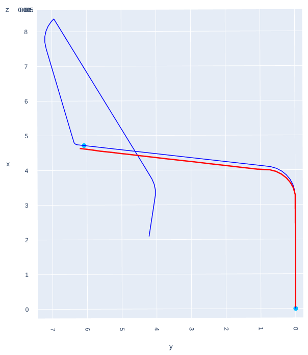
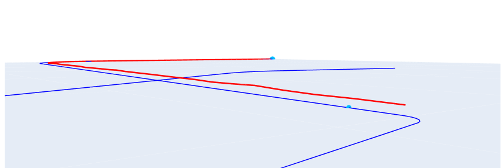
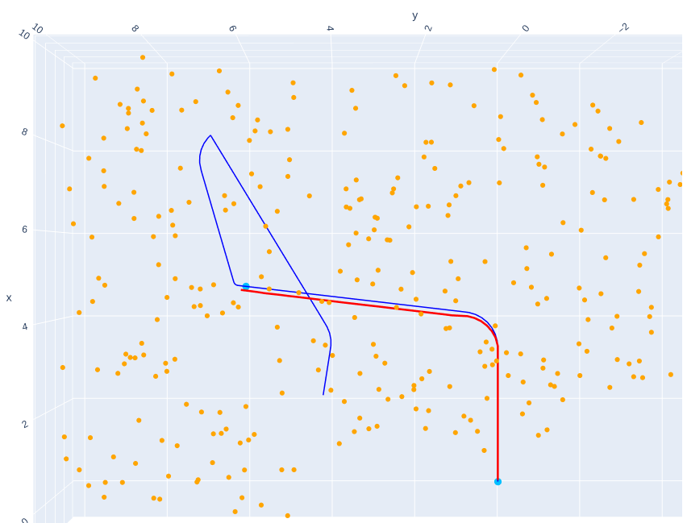
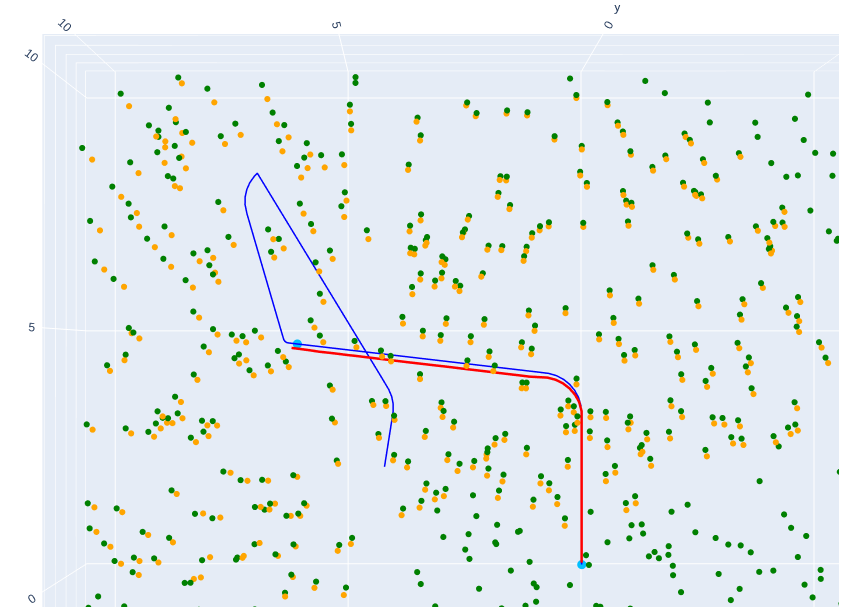
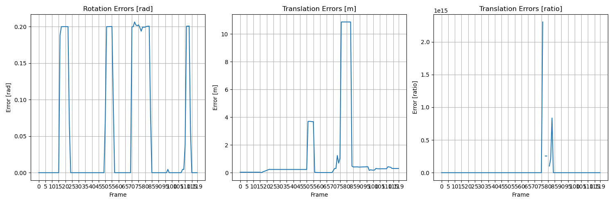

# Projective ICP Visual Odometry

<p align="center">

</p>

## Description
This project implements a projective ICP based visual odometry, to estimate both the trajectory of a robot and the 3D map of the visual features.
The robot is equioped with a monocular camera with known intrinsic and extrinsic parameters. 

### Data
Set of 120 measurements where each measurement contains a variable set of pairs (image_point, appearance), where:
- image point: $[r,c] \quad 1 \times 2$ vector. 
- appearance: $[f_1, ..., f_{10}] \quad 1 \times 10$ vector (feature descriptor)


### Algorithm

#### Initialization step
The initial pose (the one relative to the measurement 0) is set to the identity. Then the estimate of the first pose is computed with the following steps:
  
1. match the image points of the measurement 0 with the image points of the measurement 1 using the appearance;
2. estimate the essential matrix relative to the first two camera poses with the set of matched image points;
3. recover the relative position between the two camera poses using the essential matrix and the set of matched image points.

These steps provide a first estimate of the pose of the camera. 

Then a first estimated of the map is computed by triangulating the image points of the first two measurement, using the estimated pose.

#### Update step
The update steps takes one measurement at the time and perform the projective ICP algorithm between the current measurement and the current estimated 3D map, to recover the relative pose of the camera with these steps:
1. matches the image points of the current measurement with the 3D points of the map using the appearance;
2. performs one step of the projective ICP algorithm;
3. repeats until the maximum number of iterations is reached or a stopping criterion is met.

Using the new estimated pose of the camera from the projective ICP, are triangulated and added to the estimated map a new set of 3D points.

The update step is repeated for each measurement.

#### Projective ICP
A single step of the projective ICP is divided in two parts:
1. linearize the problem;
2. resolve the linerized problem with a least square approach.
   
The linearization part takes as input the reference image points (from the measurement) and the current world points from the estimated map, already matched, and the current pose of the camera w.r.t the world ${}^wT_{c_0}$. Then, calculates the matrix $H$ and the vector $b$ by computing for each pair of points the error $e$ and the jacobian $J$ in this way:
- Projected world point: 
 ```math
 \begin{align}
 \text{World point in camera coordinates (hom): } &\hat{p}_{hom} = inv({}^wT_{c_0}) p_{w,hom}\\
 \text{World point in camera coordinates: } &\hat{p} = p_{w,hom}[:3]/p_{w,hom}[3]\\
 \text{World point on image plane (hom): } &\hat{p}_{cam}=K p_w\\
 \end{align}
 ```
 - Error: 
 ```math
 e = p_r-\hat{p}_{cam}
 ```
- Jacobian: 
 ```math
 \begin{align}
 J &= J_{proj}(\hat{p}_{cam})  K  J_{icp}\\
 J_{icp} &= [I_{3\times3} | ⌊-\hat{p}⌋_\times] \\
 J_{proj}(\hat{p}_{cam}) &= \begin{bmatrix}\frac{1}{z} & 0 & -\frac{x}{z^2} \\ 0 & \frac{1}{z} & \frac{y}{z^2} \end{bmatrix}
 \end{align}
 ```

Then the error is used to compute the $chi = e^T e$:
- if $chi \le kernel \space threshold$, then the point is considered as **inlier**, 
- otherwise is discarded because is an **outlier**.

The errors and jacobians from the inliers are used to compute $H$ and $b$ as:
```math
\begin{align}
H &= H + J^T J \\
b &= b + J^T e 
\end{align}
```

Then a 6D vector describing the relative pose of the camera w.r.t the previous pose is calculated by solving 
```math
\begin{align}
dx \leftarrow slove_{lstq}(H dx = -b) \\
{}^wT_{c_1} = v2T(dx) {}^wT_{c_0}

\end{align}
```

## Usage
1. Install the requirements:
    ```
    pip3 install -r requirements.txt
    ```
2. Run the main
    ```
    python3 main.py
    ```


## Results

### Visual results
Legend:
- **<span style="color: firebrick;">red</span>**: estimated trajectory;
- **<span style="color: royalblue;">blue</span>**: ground truth trajectory;
- **<span style="color: orange;">orange</span>**: estimated map.
- **<span style="color: green;">green</span>**: ground truth map.

| Trajectory from top view | Trajectory from side views |
|:--------:|:--------:|
| <p align="center"></p> | <p align="center"></p> <br> <p align="center"></p> |

| Estimated map | Estimated map and GT map | 
|:--------:|:--------:|
| <p align="center"></p> | <p align="center"></p> |


### Numerical results
The algorithm works well, but being without any correction the error increase with the iterations. Moreover, curves in general are very diffucult to handle. Indeed, as we can see from the plots 
<p align="center">

</p>
